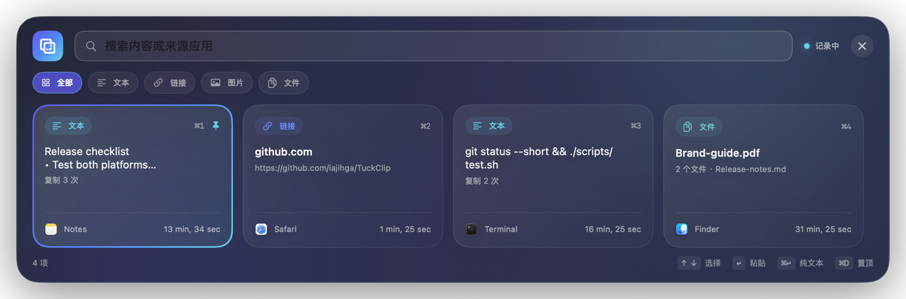

# TuckClip

English · [简体中文](README.md)

[](https://github.com/iajihga/TuckClip/actions/workflows/ci.yml)
[](https://github.com/iajihga/TuckClip/releases)
[](LICENSE)

A clean, local-first clipboard history app for macOS and Windows.



## Features

- Capture copied text, links, images, and files
- Search, filter by type, pin favorites, and delete entries
- Open from a global shortcut and customize it in Settings
- Keyboard navigation and optional paste-after-selection
- Pause capture and control retention and history size
- Exclude apps whose clipboard contents should not be recorded
- No account or telemetry; history stays on your device

## Download

Get the right build for your device from [GitHub Releases](https://github.com/iajihga/TuckClip/releases):

| Platform | Recommended asset |
|---|---|
| Apple silicon Mac | `TuckClip-*-macOS-arm64.dmg` |
| Intel Mac | `TuckClip-*-macOS-x86_64.dmg` |
| Windows x64 | `TuckClip-*-Windows-x64-Setup.exe` |
| Windows ARM64 | `TuckClip-*-Windows-arm64-Setup.exe` |

Portable Windows ZIPs are available as well. Every release includes a `SHA256SUMS.txt` file.

> The current public builds do not use a paid code-signing identity. macOS or Windows may show a source warning on first launch. Download only from this repository's Releases page and verify the checksum.

## Usage

1. Start TuckClip. It stays in the menu bar or system tray.
2. Copy text, links, images, or files as usual.
3. Press `⌥⌘V` on macOS or `Ctrl+Alt+V` on Windows to open your history.
4. Search or select an item, then press Enter to paste it.

Change the global shortcut under **Settings → Recording → Shortcut**. If a new combination is unavailable, TuckClip keeps the previously working shortcut active.

## Requirements

- macOS 14 or later
- Windows 11; Windows 10 22H2 is supported on a best-effort basis

Automatic paste on macOS needs Accessibility permission. Without it, TuckClip still restores the clipboard for manual paste. Manual paste may also be required when targeting an elevated Windows app.

## Data and privacy

TuckClip has no account, telemetry, cloud sync, or runtime network requests. Clipboard history is stored in the current user's local data directory:

- macOS: `~/Library/Application Support/TuckClip/`
- Windows: `%LOCALAPPDATA%\TuckClip`

Clipboard history can contain sensitive information. Pause capture before copying passwords or keys, and exclude password managers or other sensitive apps in Settings. See the [Security Policy](SECURITY.md) for details.

## Build from source

macOS requires Xcode 16.3 or later:

```bash
xcodebuild \
  -project TuckClip.xcodeproj \
  -scheme TuckClip \
  -configuration Debug \
  -derivedDataPath .build/DerivedData \
  CODE_SIGNING_ALLOWED=NO \
  build

./scripts/test.sh
```

Windows requires the .NET 10 SDK selected by `windows/global.json`:

```powershell
dotnet restore .\windows\TuckClip.Windows.slnx --locked-mode
.\windows\scripts\Test.ps1 -NoRestore
dotnet run --project .\windows\src\TuckClip.Windows\TuckClip.Windows.csproj
```

## Contributing

Issues and pull requests are welcome. Please read the [Contributing Guide](CONTRIBUTING.md), [Code of Conduct](CODE_OF_CONDUCT.md), and [Security Policy](SECURITY.md) before you begin.

## License

TuckClip is available under the [MIT License](LICENSE).
