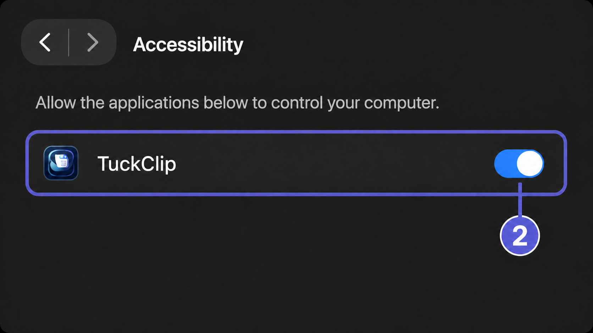

# TuckClip — Clipboard History Manager for macOS and Windows

English · [简体中文](README.zh-CN.md)

[](https://github.com/mzopedia/TuckClip/actions/workflows/ci.yml)
[](https://github.com/mzopedia/TuckClip/releases)
[](LICENSE)

TuckClip is a free, open-source clipboard history manager for macOS and Windows. It keeps copied text, links, images, and files on your device so you can search, organize, and paste them again whenever you need them.


## Features

- Clipboard history for text, links, images, and files
- Fast search, type filters, pinned items, and quick deletion
- Customizable global shortcut: `⌥⌘V` on macOS and `Ctrl+Alt+V` on Windows by default
- Keyboard navigation and optional automatic paste after selection
- Capture pause, retention period, and history size controls
- Per-app exclusions for clipboard content you do not want to save
- Interface language that follows the system or uses English or Simplified Chinese
- Automatic update checks for installed builds, with confirmation before installation
- Local clipboard storage with no account, telemetry, or cloud sync

## Download TuckClip

Download the latest version from [GitHub Releases](https://github.com/mzopedia/TuckClip/releases/latest):

| Platform | Recommended download |
|---|---|
| Apple silicon Mac | `TuckClip-*-macOS-arm64.dmg` |
| Intel Mac | `TuckClip-*-macOS-x86_64.dmg` |
| Windows x64 | `TuckClip-*-Windows-x64-Setup.exe` |
| Windows ARM64 | `TuckClip-*-Windows-arm64-Setup.exe` |

Portable Windows ZIPs are also available. Installed builds check GitHub Releases for stable updates and ask before downloading and restarting. Portable ZIPs remain manually updatable. Every release includes `SHA256SUMS.txt` for file verification.

> Release builds are currently unsigned, so macOS or Windows may ask you to confirm the first launch. Download TuckClip only from this repository and verify the checksum.

### First launch on macOS

TuckClip is not yet notarized by Apple. macOS may block the first launch even when the downloaded file matches the published checksum. Do not disable Gatekeeper and do not run random Terminal commands. Instead:

1. Drag `TuckClip.app` from the DMG to **Applications**, then try to open it once.
2. If macOS blocks it or offers to move it to the Trash, open **System Settings → Privacy & Security**, scroll to **Security**, and select **Open Anyway** for TuckClip. Confirm the next macOS prompt.


Automatic paste needs a separate Accessibility permission. On first successful launch, TuckClip opens its **Privacy** settings with a guided setup. Select **Request Permission**, then **Open Accessibility Settings**, turn on TuckClip, and return to the app. Without this permission, selecting an item still copies it safely; press `⌘V` yourself.



Overriding this protection carries risk because Apple has not checked the app. Only follow these steps if you intentionally downloaded TuckClip from `github.com/mzopedia/TuckClip` and the checksum matches. The **Open Anyway** option is available for about an hour after a blocked launch attempt. [Read Apple's guidance](https://support.apple.com/guide/mac-help/open-a-mac-app-from-an-unknown-developer-mh40616/mac).

```bash
cd ~/Downloads
shasum -a 256 --ignore-missing -c TuckClip-v*-SHA256SUMS.txt
```

## Quick start

1. Launch TuckClip. It stays available from the macOS menu bar or Windows system tray.
2. Copy text, a link, an image, or a file as usual.
3. Press `⌥⌘V` on macOS or `Ctrl+Alt+V` on Windows to open clipboard history.
4. Search for an item, select it, and press Enter to paste.

You can change the shortcut under **Settings → Capture → Shortcut**. If the new combination is already in use, TuckClip keeps the previous shortcut active.

Choose **Follow System**, **English**, or **Simplified Chinese** under **Settings → Capture → Language**. The interface updates immediately.

TuckClip checks for stable updates after launch. You can also choose **Check for Updates…** from the macOS menu bar or Windows tray menu. An update is installed only after you confirm it.

## Privacy

TuckClip stores clipboard history locally for the current user:

- macOS: `~/Library/Application Support/TuckClip/`
- Windows: `%LOCALAPPDATA%\TuckClip`

Clipboard history can contain sensitive information. Pause capture before copying passwords or private keys, and exclude password managers or other sensitive apps in Settings. See the [Security Policy](SECURITY.md) for more information.

## System requirements

- macOS 14 or later
- Windows 11; Windows 10 22H2 is available on a best-effort basis

Automatic paste on macOS requires Accessibility permission. See [First launch on macOS](#first-launch-on-macos). Manual paste may also be necessary when the target Windows app is running as administrator.

## Frequently asked questions

### What is TuckClip?

TuckClip is a cross-platform clipboard manager that gives macOS and Windows users a searchable history of recently copied text, links, images, and files.

### Is TuckClip free and open source?

Yes. TuckClip is free to use and released under the MIT License.

### Can I change the clipboard history shortcut?

Yes. The global shortcut is customizable on both macOS and Windows from TuckClip Settings.

### Does TuckClip upload or sync clipboard data?

No. Clipboard history stays in the local user data directory and is never uploaded by TuckClip. The app only connects to this project's GitHub Releases to check for and download updates.

## Build from source

macOS requires Xcode 16.3 or later:

```bash
xcodebuild \
  -project TuckClip.xcodeproj \
  -scheme TuckClip \
  -configuration Debug \
  -derivedDataPath .build/DerivedData \
  CODE_SIGNING_ALLOWED=NO \
  build

./scripts/test.sh
```

Windows requires the .NET 10 SDK selected by `windows/global.json`:

```powershell
dotnet restore .\windows\TuckClip.Windows.slnx --locked-mode
.\windows\scripts\Test.ps1 -NoRestore
dotnet run --project .\windows\src\TuckClip.Windows\TuckClip.Windows.csproj
```

For project structure, development setup, and pull request guidance, read [CONTRIBUTING.md](CONTRIBUTING.md).

## Community and security

Issues and pull requests are welcome. Please follow the [Code of Conduct](CODE_OF_CONDUCT.md). To report a vulnerability privately, use the process described in the [Security Policy](SECURITY.md).

## License

TuckClip is available under the [MIT License](LICENSE).
