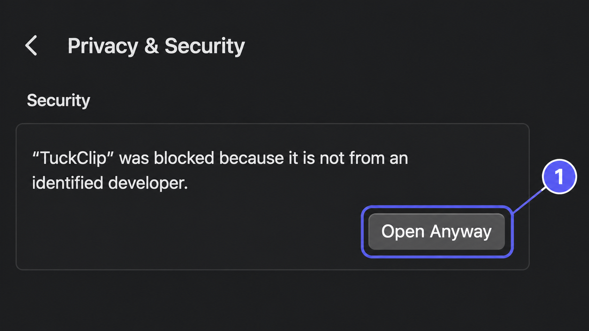
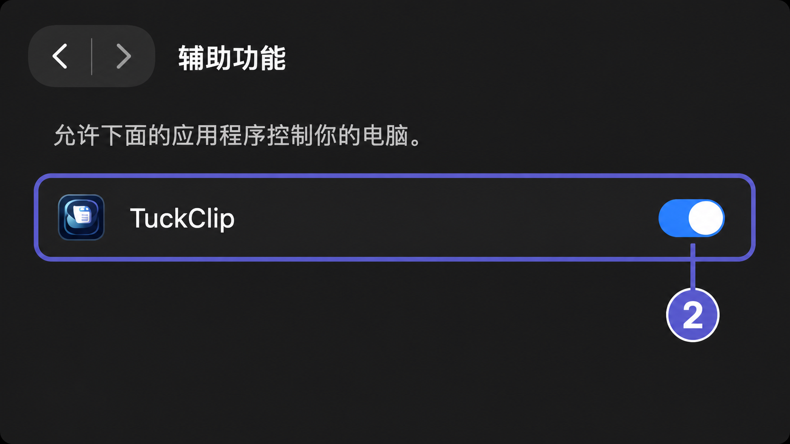

# TuckClip — macOS 与 Windows 剪贴板历史工具

[English](README.md) · 简体中文

[](https://github.com/mzopedia/TuckClip/actions/workflows/ci.yml)
[](https://github.com/mzopedia/TuckClip/releases)
[](LICENSE)

TuckClip 是一款免费、开源的 macOS 与 Windows 剪贴板历史工具。它会在本机保存复制过的文本、链接、图片和文件，方便你随时搜索、整理并再次粘贴。


## 功能

- 记录文本、链接、图片和文件
- 快速搜索、类型筛选、置顶与删除
- 自定义全局快捷键；默认按键为 macOS `⌥⌘V`、Windows `Ctrl+Alt+V`
- 键盘导航与选择后自动粘贴
- 暂停记录，并设置保留期和历史数量
- 按应用排除不想保存的剪贴板内容
- 界面可跟随系统语言，也可指定简体中文或 English
- 安装版自动检查更新，安装前由用户确认
- 剪贴板数据保存在本机，无账号、遥测或云同步

## 下载 TuckClip

前往 [GitHub Releases](https://github.com/mzopedia/TuckClip/releases/latest) 下载最新版：

| 平台 | 推荐文件 |
|---|---|
| Apple 芯片 Mac | `TuckClip-*-macOS-arm64.dmg` |
| Intel Mac | `TuckClip-*-macOS-x86_64.dmg` |
| Windows x64 | `TuckClip-*-Windows-x64-Setup.exe` |
| Windows ARM64 | `TuckClip-*-Windows-arm64-Setup.exe` |

Windows 还提供免安装的 ZIP。安装版会从 GitHub Releases 检查稳定更新，并在下载和重启前征求你的确认；免安装 ZIP 仍需手动更新。每个版本都附带 `SHA256SUMS.txt`，可用于核对文件。

> 当前公开构建尚未签名，因此 macOS 或 Windows 首次启动时可能要求你确认。请只从本仓库下载 TuckClip，并核对校验值。

### macOS 首次打开

TuckClip 目前尚未通过 Apple 公证。即使下载文件与发布的校验值一致，macOS 也可能拦截首次启动。请不要关闭 Gatekeeper，也不要执行来源不明的终端命令。正确操作是：

1. 先把 `TuckClip.app` 从 DMG 拖入“**应用程序**”，再尝试打开一次。
2. 如果 macOS 阻止打开或提示移到废纸篓，进入“**系统设置 → 隐私与安全性**”，滚动到“**安全性**”，找到 TuckClip 后点击“**仍要打开**”，再确认一次系统提示。



选择记录后自动粘贴还需要单独的辅助功能权限。第一次成功启动时，TuckClip 会直接显示“隐私”设置和操作步骤。点击“**请求权限**”，再点击“**打开辅助功能设置**”，开启 TuckClip 后返回应用即可。未授权时，选择记录仍会安全地复制到剪贴板，你可以手动按 `⌘V`。



绕过这项保护存在风险，因为 Apple 尚未检查这个应用。只有当你主动从 `github.com/mzopedia/TuckClip` 下载 TuckClip，并且校验值一致时，才应执行这些操作。“仍要打开”通常只会在尝试启动后保留约一小时。详见 [Apple 官方说明](https://support.apple.com/zh-cn/guide/mac-help/mh40616/mac)。

```bash
cd ~/Downloads
shasum -a 256 --ignore-missing -c TuckClip-v*-SHA256SUMS.txt
```

## 快速开始

1. 启动 TuckClip，它会常驻 macOS 菜单栏或 Windows 系统托盘。
2. 像平时一样复制文本、链接、图片或文件。
3. 在 macOS 按 `⌥⌘V`，或在 Windows 按 `Ctrl+Alt+V`，打开剪贴板历史。
4. 搜索并选中一条记录，然后按回车粘贴。

你可以在“**设置 → 记录 → 快捷键**”中修改快捷键。如果新按键已被其他应用占用，TuckClip 会继续使用原来的快捷键。

你也可以在“**设置 → 记录 → 语言**”中选择“跟随系统”“简体中文”或“English”，界面会立即更新。

TuckClip 会在启动后检查稳定更新。你也可以从 macOS 菜单栏或 Windows 托盘菜单选择“**检查更新…**”。只有确认后，应用才会安装更新。

## 隐私

TuckClip 会把剪贴板历史保存在当前用户的本机目录：

- macOS：`~/Library/Application Support/TuckClip/`
- Windows：`%LOCALAPPDATA%\TuckClip`

剪贴板可能包含敏感信息。复制密码或私钥前，可以先暂停记录；也建议在设置中排除密码管理器等敏感应用。更多说明见[安全政策](SECURITY.md)。

## 系统要求

- macOS 14 或更高版本
- Windows 11；Windows 10 22H2 为尽力兼容

macOS 自动粘贴需要辅助功能权限，详见“[macOS 首次打开](#macos-首次打开)”。目标 Windows 应用以管理员身份运行时，也可能需要手动粘贴。

## 常见问题

### TuckClip 是什么？

TuckClip 是一款跨平台剪贴板管理工具，为 macOS 和 Windows 提供可搜索的文本、链接、图片与文件复制历史。

### TuckClip 免费、开源吗？

是的。TuckClip 可以免费使用，并采用 MIT License 开源。

### 可以修改唤起剪贴板历史的快捷键吗？

可以。macOS 和 Windows 版本都支持在设置中自定义全局快捷键。

### TuckClip 会上传或同步剪贴板内容吗？

不会。剪贴板历史只保存在本机用户目录，TuckClip 不会上传它。应用仅会连接本项目的 GitHub Releases，用于检查和下载更新。

## 从源码构建

macOS 需要 Xcode 16.3 或更高版本：

```bash
xcodebuild \
  -project TuckClip.xcodeproj \
  -scheme TuckClip \
  -configuration Debug \
  -derivedDataPath .build/DerivedData \
  CODE_SIGNING_ALLOWED=NO \
  build

./scripts/test.sh
```

Windows 需要仓库 `windows/global.json` 指定的 .NET 10 SDK：

```powershell
dotnet restore .\windows\TuckClip.Windows.slnx --locked-mode
.\windows\scripts\Test.ps1 -NoRestore
dotnet run --project .\windows\src\TuckClip.Windows\TuckClip.Windows.csproj
```

项目结构、开发环境和 pull request 说明见[贡献指南](CONTRIBUTING.md)。

## 社区与安全

欢迎提交 issue 和 pull request。参与项目请遵守[行为准则](CODE_OF_CONDUCT.md)；如果需要私下报告安全问题，请按[安全政策](SECURITY.md)中的方式联系。

## 许可证

TuckClip 使用 [MIT License](LICENSE)。
